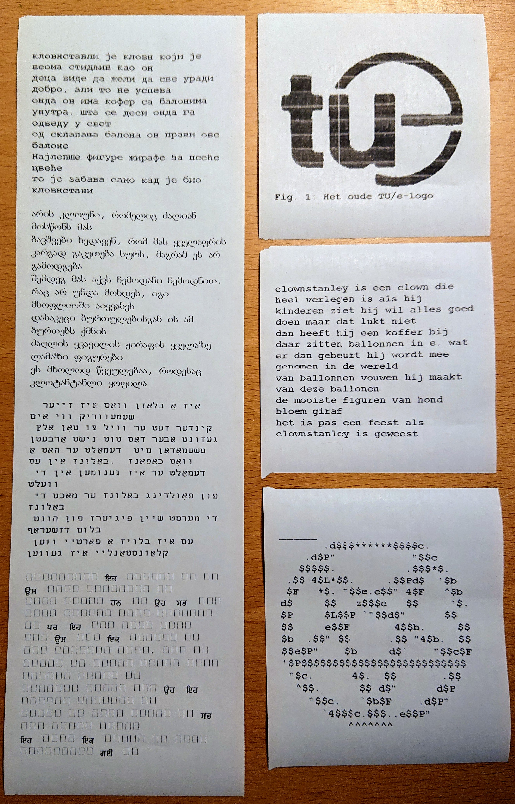

# SureMark Telegram Fax Bot
Telegram bot and Microsoft Office macro to automatically print text messages in Telegram on an IBM SureMark receipt printer.
This version of the SureMark 4610 unfortunately only has USB and a proprietary protocol, so it doesn't work natively on Linux or any modern OS. 
Therefore, the only way to get it to print anything is using some windows 16-bit executable.

| The printer | Samples |
|-------------|---------|
|  |  |

## Basic Setup
The SureMark is physically connected to a Raspberry Pi, which exposes the usb interface to an x86 Linux server using [usbip](http://usbip.sourceforge.net/).
On the Linux server, a virtual machine is running Windows XP.
The python code is also running on the Linux Server.
Whenever the user sends a text message, the bot creates a `.docx` file in a shared folder with the VM.

On Windows, a batch script polls the folder every 500 ms.
If it encounters the Word document, it starts Microsoft Word 2007 using a specific macro.

The macro loads the document file and appends it to an empty document which has the right page format and margins for the printer.
The macro then prints the document, suppressing any errors or warnings (about margins).
Lastly it deletes the file and terminates Word.

## Features
* Temporarily disable printing, using the `/sleep` command
* Manage list of blocked and allowed users from telegram, as admin.
* Print unicode text. Including EMOJI 👁👅👁!!
* Print images (with captions), automatically converted to black and white bitmaps.
* Print Microsoft Office `.doc` and `.docx` files.
* Request a template Microsoft Office `.docx` file with the correct paper size.
* Get notified when you receive a fax.
* Supports faxing stickers (remapping transparency to white)
* Print superfast using a resident font, using the \<F\> html-style tag
* Print numbers as EAN-13 barcode using the \<BAR\> tag
* Pipe any output from your terminal to the printer with `mark`!
* Print png files without compression, ideal for extreme aspect ratios!
* Using [Willus' pdf reflower](https://www.willus.com/k2pdfopt/) you can print any pdf, such as two-column scientific publications. Just do `k2pdfopt input.pdf -w 400 -h 1620 -dpi 167 -idpi -2 && pdftoppm input_k2opt.pdf -r 250 out -png` and then send the resulting images to your bot (as files). Make sure you have `k2pdfopt` and `pdftoppm` in your path.
* Automatically convert anything into a qr code using the `\qr` command
* Directly put the bot in sleep mode using `ssh SERVER "pkill -USR2 suremark"`. Can be used with Apple's automation system to mute the SureMark while your phone is on Don't Disturb.
* User help command

## Installation
### Linux / Server
1. Review `src/linux/*.service`, `src/opt/suremark.py` and `src/config/config.ini`: replace `>>>USERNAME<<<` with the username that will be running the bot on the server.
2. In `config.ini`, also place your telegram bot token and user id.
3. Verify you have `virtualenv` installed on your system, and run `source install`.

4. Create a new machine in Virtualbox.
5. Uncheck *Cable Connected* in `Virtualbox settings>Network` to isolate the VM.
6. Map `~/.config/suremark/shared` as a shared auto-mounting folder to `Z:\` in the guest.
7. Install the VirtualBox extension pack; `VBoxManage extpack install Oracle*.vbox-extpack`.
8. Create a device filter for passing through the usb device to the VM.

9. Enable the systemd units. For `vboxvmservice`, you need to specify the machine UUID as follows: `systemctl enable vboxvmservice@VM_UUID.service`. You can get this UUID from `VBoxManage list vms`.

### Windows / Virtual Machine
1. Install Windows XP (32 bit).
2. Install the IBM printer driver, and make it the default printer.
3. Install Microsoft Office 2007.
4. Embed the macro in Word by opening Word, pressing `Alt`+`F11` and pasting the code in a new script file.
5. Enable *Microsoft Scripting Runtime* in `Microsoft Visual Basic>Tools>References`.
6. Copy `src/windows/suremark` and its content to `C:\`.
7. Execute `C:\suremark\poller.bat` when Windows starts (e.g. by placing a shortcut in `C:\Documents and Settings\All Users\Start Menu\Programs\Startup`).
8. For Emoji support, install an emoji font (such as Segoe UI Emoji, `seguiemj.ttf`, make sure its name matches that in the `.ini`-file). Go to `Control Panel>Fonts` and drag & drop the `.ttf` file.

### USB-over-IP
When you can't connect the printer to the server physically, you can connect it to anything else running Linux, and virtually connect it to the server using usbip.

**usbip server**
1. Install `usbip`.
2. Copy `src/raspberry/usbipd@.service` to `/etc/systemd/system`.
3. Enable and start with `usbipd@04b3:4535.service`, verify with lsusb that the usb vendor and product ID's are correct.

**usbip client**
1. Install `usbip`.
2. Run `sudo modprobe vhci-hcd`.
3. List the available usb devices on the server; `usbip list -r SERVER`.
4. Attach the printer, e.g. `sudo usbip attach -r SERVER -b 1-1.2`.

## The Mark Pipe
Allows you to pipe any `stdout` to your printer, such as `ls | mark`.

### Linux / Client
* Review `src/pipe/suremark_pipe/send_file`; change folder locations and server address.
* Review `src/pipe/main.cpp`; update the username.
* Make sure you have ssh access to your server with a (passwordless) key pair.
* Go to `src/pipe` and run `source install`.

## Tips
You can enable RDP for your Windows XP VM for easier administration.
1. Shut down your VMs.
2. Download the extpack from [Oracle](https://download.virtualbox.org/virtualbox/)
3. Install extpack: `vboxmanage extpack install ep.vbox-extpack`
4. Execute `VBoxManage modifyvm "Windows XP" --vrde on`.
5. RDP in, e.g. by `wlfreerdp /v:SERVER`.
6. Consider turning it off again.

## TODO
* Add automatic services. Printing reddit posts, weather.. Perhaps via RSS.

