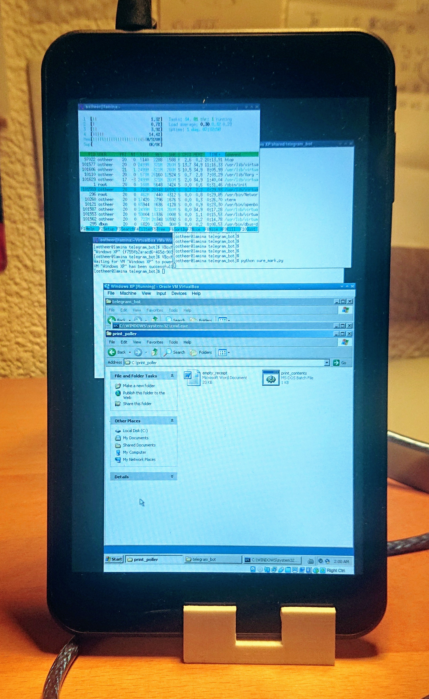

# ⚡️💯🔥✅SnapFax✅🔥💯⚡️: Making faxing trendy again!

Telegram bot and Windows scripts to automatically print text messages in Telegram on an IBM SureMark receipt printer.
This version of the SureMark 4610 unfortunately only has USB and a proprietary protocol, so it doesn't work natively on Linux. Therefore, the only way to get it to print anything is using some windows 16-bit executable.

I had an old crappy Windows Tablet lying around collecting dust, so I repurposed it.

Now it's a crappy tablet printing Word 2007 documents via Telegram Running Windows XP in Virtualbox on Arch Linux!


| The printer | The tablet | Samples |
|------------|-------------|-------------|
|  |  |  |

## Basic Setup

Linux machine running Windows XP (32 bit) in a VM, with a shared folder (`Z:\` in Windows).

The Python telegram bot runs on Linux.
Whenever the user sends a text message, it creates a file `to_printN.extension` in a shared folder.

The batch script `print_contents.bat` polls the folder every 500ms.
If it encounters `to_printN.{doc(x), txt, bmp}`, it starts Microsoft Word 2007 using a specific macro (`macro.vba`).

The macro reads the `to_print*` file and opens it or appends it to `empty_receipt.doc`.
The macro then prints the document, suppressing any errors or warnings (about margins).
Lastly it deletes the file and terminates Word.

The script `macro.vba` is embedded in the base template of the Microsoft Office installation, so the file is not explicitly present on the system.

## Features
* Temporarily disable printing, using the `/sleep` command
* Manage list of blocked and allowed users from telegram, as admin.
* Print unicode text. Including EMOJI 👁👅👁!!
* Print images (with captions), automatically converted to black and white bitmaps.
* Print Microsoft Office `.doc` and `.docx` files.
* Request a template Microsoft Office `.doc` file with the correct paper size.
* Get notified when you receive a fax.
* Supports faxing stickers (remapping transparency to white)
* Print superfast using a resident font, using the \<F\> html-style tag
* Print numbers as EAN-13 barcode using the \<BAR\> tag
* Pipe any output from your terminal to the printer with `mark`!
* Print png files without compression, ideal for extreme aspect ratios!
* Using [Willus' excellent pdf reflower](https://www.willus.com/k2pdfopt/) you can print any pdf, such as scientific publications. Just do `k2pdfopt input.pdf -w 400 -h 1620 -dpi 167 -idpi -2 && pdftoppm input_k2opt.pdf -r 250 out -png` and then send the resulting images to your bot (as files). Make sure you have `k2pdfopt` and `pdftoppm` in your path.
<<<<<<< HEAD
* Automatically convert anything into a qr code using the `\qr` command
=======
* Directly nuke the bot into sleep mode using ``` ssh host_machine "kill -USR2 \`pgrep suremark_tg_bot\`" ```
>>>>>>> 8687f83a1666f9ba8dd2681e5f36da7ff4104767

## Instructions
Not necessarily in the correct order
* Install Windows XP and Office 2007 in the VM
* Install the IBM printer driver, and make it the default printer
* Embed the macro in Word by opening Word, pressing `Alt`+`F11` and pasting the code in a new script file.
* On Linux, install `pip`, and via that install `python-telegram-bot`, `numpy`, `emoji`, `htmlparser`, `python-docx`, `pillow`, `segno` and `tinydb`.
* Place `print_poller` and its content on `C:\`
* Mount the VirtualBox shared folder on `Z:\`
* Create the directories `Z:\telegram_bot\print`, `Z:\telegram_bot\queue` and `Z:\telegram_bot\pipe`
* Execute `C:\print_poller\print_contents.bat` when Windows starts (e.g. by placing a shortcut in `C:\Documents and Settings\Admin\Start Menu\Programs\Startup`).
* Place `suremark_tg_bot`, `ibmcallbacks.py` and `ibmprint.py` in `/opt/suremark_tg_bot`.
* Do `chmod 755 /opt/suremark_tg_bot/suremark_tg_bot`.
* Edit the `*.service` files to include your linux username and place them in `/etc/systemd/system` and enable them. The VM service is enabled with `sudo systemctl enable vboxvmservice@VM_UUID.service`. You can get this UUID with `VBoxManage list vms`.
* Edit `suremark_tg_bot` to point to your `.ini` file
* Use `setterm --blank `{`force` or `poke`}` --term linux </dev/tty1` to turn off the screen
* For unicode support it may be necessary to enable *Microsoft Scripting Runtime* in `Microsoft Visual Basic>Tools>References`
* Uncheck *Cable Connected* in Virtualbox settings>Network to isolate the VM
* For Emoji support, install an emoji font (such as Segoe UI Emoji, `seguiemj.ttf`). Make sure its name matches that in the `.ini`-file.
* Directly nuke the bot into sleep mode using ``` ssh host_machine "kill -USR2 \`pgrep suremark_tg_bot\`" ```
* Automatically convert anything into a qr code using the `\qr` command

## Tips
You can enable RDP for your Windows XP VM for easier administration.
1. Shut down your VMs
2. Install the required Virtualbox extension pack: `VBoxManage extpack install Oracle*.vbox-extpack`
3. Execute `VBoxManage modifyvm "Windows XP" --vrde on`
4. RDP in, e.g. by `xfreerdp /v:ADDRESS_OF_HOST`
5. Consider turning it off again for safety

## TODO
* Add automatic services. Printing reddit posts, weather.. Perhaps via RSS

## Installing Linux on the tablet
The Lamina tablet uses a cheap Atom-chipset that doesn't support the regular 64 bit EFI bootfiles.
This is the case for many of these no-name Chinese Windows tablets from the Windows 8 launch era.
Therefore, it is necessary to use a standalone GRUB IA32 EFI file to chainload the Linux installer.

See the Arch Wiki for details: https://wiki.archlinux.org/index.php/Unified_Extensible_Firmware_Interface#Booting_64-bit_kernel_on_32-bit_UEFI


## Notes
I don't own any rights to the IBM driver. Consider it abandonware.
Same goes for the Segoe Emoji font.


